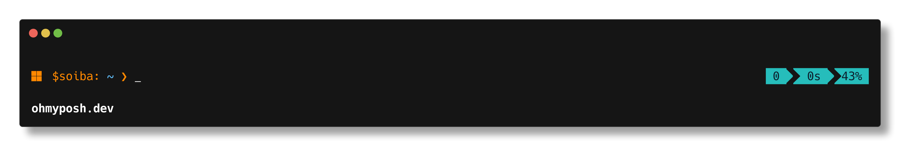

  <h1>Eric Vuu (WolfxForce)</h1>

  

    
    
    
  

--

  

    
  

---

#### 📈 Most stars repo

<a href="https://star-history.com/#silverwolfceh/airdropclaimer&Date">
  <picture>
    <source media="(prefers-color-scheme: dark)"
            srcset="https://api.star-history.com/svg?repos=silverwolfceh/airdropclaimer&type=Date&theme=dark" />
    <source media="(prefers-color-scheme: light)"
            srcset="https://api.star-history.com/svg?repos=silverwolfceh/airdropclaimer&type=Date" />
    
  </picture>
</a>

---

  

